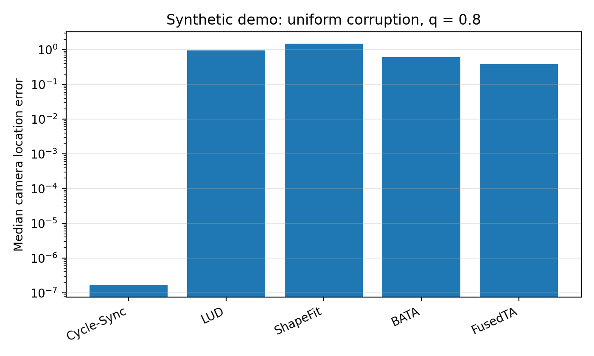
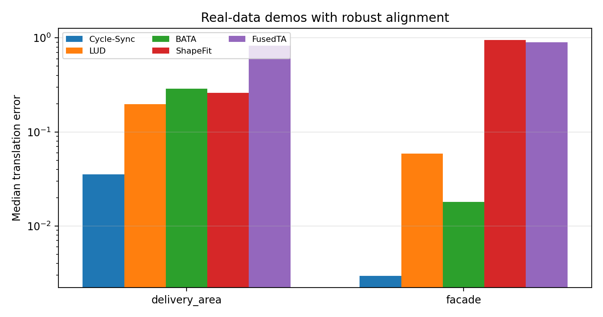

# Cycle-Sync

Cycle-Sync is a robust global camera pose estimation method for recovering camera locations from pairwise directions under heavy corruption. This repository contains parallel Python and MATLAB implementations, synthetic-data generators, real-data demos, and baseline comparisons.

To use Cycle-Sync, please cite the following NeurIPS 2025 spotlight paper: [Paper (OpenReview PDF)](https://openreview.net/pdf?id=M3zxsDL2Rk)

The location solver uses cycle-consistency message passing, T-AAB initialization, and a Welsch-type reweighting scheme. The default parameters are:

| Parameter | Default |
|---|---:|
| Maximum iterations | `20` |
| Cycle weight `beta` | `20` |
| Annealing schedule | `lambda_t = t / (t + 10)` |
| IRLS regularization | `1e-8` |
| T-AAB triangle truncation | `sinmin = 0.6` |
| Robust weight update | `exp(-4h) / (h + delta)` |

## Repository layout

```text
.
├── CycleSyncPython/      # Python implementation, demos, tests, and real-data .mat files
├── CycleSyncMatlab/      # MATLAB implementation, demos, tests, and matching real-data .mat files
└── README.md             # Common entry point
```

The Python and MATLAB folders are intended to be equivalent at the experiment level: they use the same synthetic corruption models, the same real-data `.mat` format, the same Cycle-Sync defaults, and the same baseline list.

## Included methods

| Method | Description |
|---|---|
| `Cycle-Sync` | Cycle-consistency reweighted WLS location solver |
| `LUD` | Least Unsquared Deviations baseline |
| `ShapeFit` | ADMM ShapeFit baseline |
| `BATA` | Baseline Desensitizing Translation Averaging |
| `FusedTA` | Fused Translation Averaging baseline |

## Quick start: Python

```bash
cd Cycle-Sync-Python
pip install -r requirements.txt
python demo/run_one_synthetic_experiment.py
python demo/run_one_real_dataset.py data/real_precomputed/delivery_area_location.mat --alignment robust
python experiments/compare_methods_real.py --data-dir data/real_precomputed --alignment robust
```

Run tests:

```bash
cd Cycle-Sync-Python
pytest -q tests
```

## Quick start: MATLAB

```matlab
cd Cycle-Sync-Matlab
startup
run('demo/run_one_synthetic_experiment.m')
run('demo/run_one_real_dataset.m')
run('experiments/compare_methods_real.m')
```

For real-data experiments, the recommended evaluation uses robust signed-scale/translation alignment. This prevents a few extreme outlier cameras from dominating the fitted scale and translation while still reporting camera errors over the full camera set.

## Representative synthetic result

Demo configuration:

```text
model = uniform corruption
n = 100
p = 0.5
q = 0.8
sigma = 0
seed = 2025
```



| Method | Median error | Mean error |
|---|---:|---:|
| Cycle-Sync | 1.68e-07 | 0.158006 |
| LUD | 0.950856 | 0.988628 |
| ShapeFit | 1.496418 | 1.513211 |
| BATA | 0.607546 | 0.756063 |
| FusedTA | 0.390215 | 0.810473 |

Cycle-Sync reaches near-exact median recovery at 80% uniform corruption in this demo.

## Representative real-data result

The small real-data demo set contains two scenes selected because Cycle-Sync has a large separation from the strongest baseline:

```text
data/real_precomputed/delivery_area_location.mat
data/real_precomputed/facade_location.mat
```

All real-data numbers below use robust signed-scale/translation alignment.



| Dataset | Method | Median error | Mean error |
|---|---|---:|---:|
| delivery_area | Cycle-Sync | 0.035242 | 0.36387 |
| delivery_area | LUD | 0.196842 | 0.338749 |
| delivery_area | ShapeFit | 0.261317 | 0.435902 |
| delivery_area | BATA | 0.289026 | 0.46202 |
| delivery_area | FusedTA | 0.823736 | 0.99406 |
| facade | Cycle-Sync | 0.002947 | 0.234012 |
| facade | LUD | 0.05868 | 0.46065 |
| facade | ShapeFit | 0.95011 | 1.032994 |
| facade | BATA | 0.01799 | 0.545244 |
| facade | FusedTA | 0.90159 | 0.996432 |

Average median translation error on these two real-data demos:

| Method | Avg. median error |
|---|---:|
| Cycle-Sync | 0.019095 |
| LUD | 0.127761 |
| BATA | 0.153508 |
| ShapeFit | 0.605714 |
| FusedTA | 0.862663 |

On this two-scene demo, Cycle-Sync has an average median error of `0.019095`, compared with `0.127761` for LUD, `0.153508` for BATA, `0.605714` for ShapeFit, and `0.862663` for FusedTA.

## Real-data file convention

The real-data loaders expect precomputed `.mat` files containing:

```text
AdjMat34
tijMat34
t_orig2_cntrd
R_global
```

Recommended compact demo data:

```text
Cycle-Sync-Python/data/real_precomputed/
├── delivery_area_location.mat
└── facade_location.mat

Cycle-Sync-Matlab/data/real_precomputed/
├── delivery_area_location.mat
└── facade_location.mat
```

## Output files

The demos write result tables and summaries under `results/`. Typical outputs include:

```text
summary.csv
summary.mat
real_method_by_dataset.csv
real_method_summary.csv
per_camera_errors.csv
```

## License

Cycle-Sync is provided for educational and research use under the license terms included in the `LICENSE` files.
